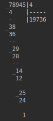
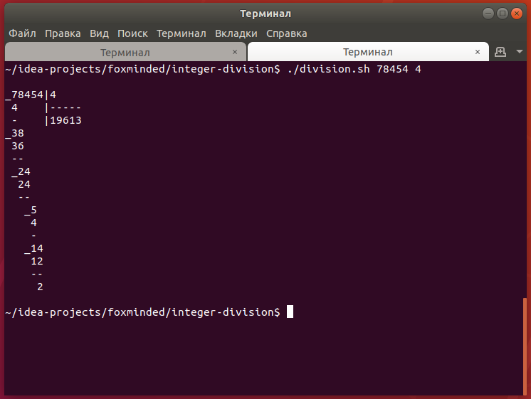
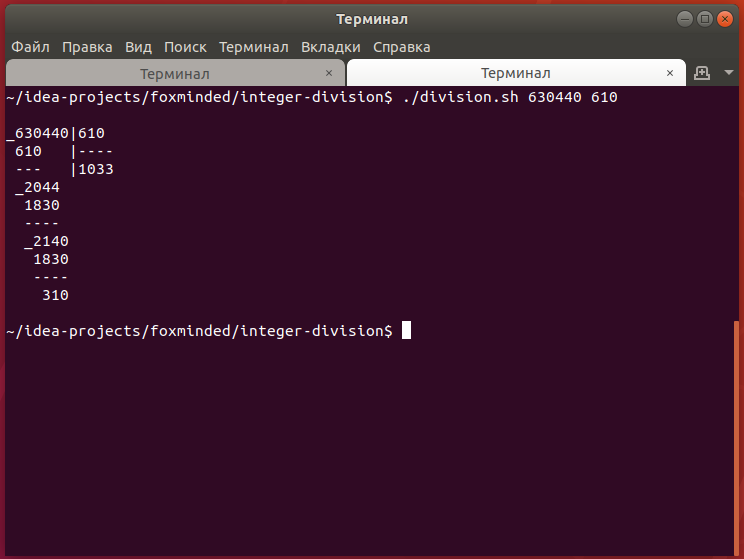
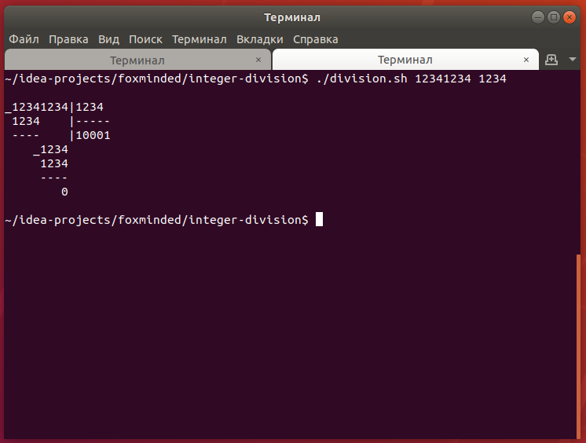

## Task 4 - Integer Division

Write an application integer-division that divides numbers and prints result into console. + JUnit tests(!!!).

Example of result:

**Articles**

- [Wikipedia](https://ru.wikipedia.org/wiki/%D0%94%D0%B5%D0%BB%D0%B5%D0%BD%D0%B8%D0%B5_%D1%81%D1%82%D0%BE%D0%BB%D0%B1%D0%B8%D0%BA%D0%BE%D0%BC)
- [Математика просто](http://math-prosto.ru/?page=pages/action-in-column/division-of-column.php)

Three basic cases running results:

